# TMS Platform Database ERD

## Entity Relationship Diagram

```mermaid
erDiagram
    users ||--o{ shipments : creates
    users ||--|| roles : has
    users }o--|| companies : belongs_to
    companies ||--o{ carriers : operates
    companies ||--o{ shipments : customer
    companies ||--o{ invoices : bill_to
    carriers ||--o{ shipments : transports
    shipments ||--o{ shipment_events : generates
    shipments ||--o{ shipment_documents : contains
    shipments ||--|| invoices : produces
    addresses ||--o{ companies : located_at
    addresses ||--o{ shipments : origin
    addresses ||--o{ shipments : destination
    addresses ||--o{ shipment_events : location
    users ||--o{ audit_logs : performs
    users ||--o{ shipment_documents : uploads
    users ||--o{ invoices : creates

    users {
        uuid id PK
        string email UK
        string password_hash
        string first_name
        string last_name
        string phone
        uuid role_id FK
        uuid company_id FK
        boolean is_active
        timestamp last_login
        timestamp created_at
        timestamp updated_at
    }

    roles {
        uuid id PK
        string name UK
        string description
        jsonb permissions
        timestamp created_at
        timestamp updated_at
    }

    companies {
        uuid id PK
        string name
        string type
        string tax_id
        string mc_number
        string dot_number
        uuid address_id FK
        uuid billing_address_id FK
        boolean is_active
        timestamp created_at
        timestamp updated_at
    }

    addresses {
        uuid id PK
        string street1
        string street2
        string city
        string state
        string postal_code
        string country
        decimal latitude
        decimal longitude
        boolean is_active
        timestamp created_at
        timestamp updated_at
    }

    carriers {
        uuid id PK
        uuid company_id FK
        string operating_authority
        string insurance_policy_number
        date insurance_expiration
        decimal cargo_coverage
        decimal liability_coverage
        jsonb equipment_types
        jsonb service_areas
        decimal rating
        boolean is_approved
        timestamp created_at
        timestamp updated_at
    }

    shipments {
        uuid id PK
        string reference_number UK
        string bol_number
        string purchase_order_number
        uuid customer_id FK
        uuid carrier_id FK
        string status
        string priority
        uuid origin_address_id FK
        uuid destination_address_id FK
        timestamp pickup_window_start
        timestamp pickup_window_end
        timestamp delivery_window_start
        timestamp delivery_window_end
        timestamp actual_pickup
        timestamp actual_delivery
        string equipment_type
        decimal weight
        decimal volume
        integer piece_count
        string commodity_description
        boolean hazardous_material
        jsonb temperature_requirements
        decimal quoted_rate
        decimal actual_rate
        decimal fuel_surcharge
        decimal accessorial_charges
        uuid created_by FK
        uuid assigned_to FK
        string notes
        timestamp created_at
        timestamp updated_at
    }

    shipment_events {
        uuid id PK
        uuid shipment_id FK
        string event_type
        timestamp event_timestamp
        uuid location_id FK
        string description
        jsonb metadata
        uuid created_by FK
    }

    shipment_documents {
        uuid id PK
        uuid shipment_id FK
        string document_type
        string file_name
        string file_path
        integer file_size
        string mime_type
        uuid uploaded_by FK
        timestamp uploaded_at
    }

    invoices {
        uuid id PK
        string invoice_number UK
        uuid shipment_id FK
        uuid bill_to_company_id FK
        date invoice_date
        date due_date
        string status
        decimal base_amount
        decimal fuel_surcharge
        decimal accessorials
        decimal total_amount
        decimal tax_amount
        string payment_method
        timestamp payment_date
        string transaction_id
        uuid created_by FK
        timestamp created_at
        timestamp updated_at
    }

    audit_logs {
        uuid id PK
        uuid user_id FK
        string action
        string table_name
        uuid record_id
        jsonb old_values
        jsonb new_values
        inet ip_address
        string user_agent
        timestamp timestamp
    }
```

## Key Relationships

1. **Users → Roles**: Many-to-One (Each user has one role)
2. **Users → Companies**: Many-to-One (Each user belongs to one company)
3. **Companies → Carriers**: One-to-One (Carrier is a specialized company)
4. **Shipments → Companies**: Many-to-One (Customer relationship)
5. **Shipments → Carriers**: Many-to-One (Transport relationship)
6. **Shipments → Addresses**: Many-to-One (Origin and Destination)
7. **Shipments → Events**: One-to-Many (Tracking events)
8. **Shipments → Documents**: One-to-Many (Supporting documents)
9. **Shipments → Invoices**: One-to-One (Billing relationship)

## Security Considerations

- Row Level Security (RLS) enabled on sensitive tables
- Audit logging for all data modifications
- GDPR compliance through data access controls
- SOC2 compliance through comprehensive audit trails